# WrongStack Architecture

This document is a repository-level architecture map for WrongStack as reviewed on 2026-06-22 (monorepo version 0.270.0). It is written for maintainers, plugin authors, and contributors who need to understand how the monorepo fits together before changing runtime behavior. Counts and package internals can drift; prefer source and tests when a detail disagrees.

WrongStack is a TypeScript/Node.js agent platform. The user-facing product is a terminal AI coding agent, but the implementation is deliberately split into reusable packages: a small core runtime, provider adapters, built-in tools, MCP integration, terminal and browser UIs, and an optional multi-agent director layer.

## Executive Summary

WrongStack is organized around four ideas:

| Idea | What it means in the codebase |
|---|---|
| A small runtime kernel | `Container`, `Pipeline`, `EventBus`, and `RunController` form the low-level runtime primitives in `packages/core/src/kernel`. |
| Explicit registries | Tools, providers, slash commands, extensions, and plugins are registered into typed registries instead of being hard-coded into the agent loop. |
| Observable agent runs | Agent runs emit typed lifecycle events for provider streaming, tool execution, compaction, MCP reconnects, subagents, errors, metrics, and UI updates. |
| Replaceable edges | Providers, tools, permissions, storage, compaction, system prompt layers, observability, and plugins are all replaceable through interfaces. |

At runtime, the CLI boots configuration and credentials, creates the dependency container, registers providers and tools, builds a `Context`, creates an `Agent`, then dispatches to single-shot mode, REPL, Ink TUI, or WebUI.

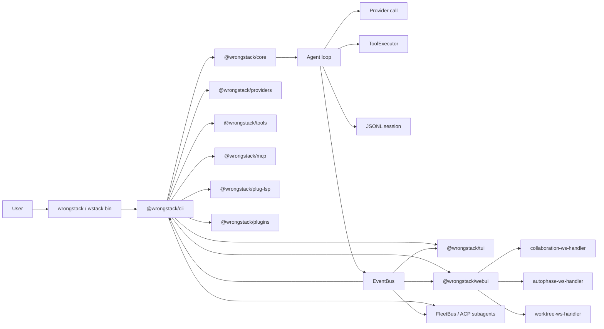

## Monorepo Map

```text
apps/
  wrongstack/       Published umbrella package. Exposes the wrongstack and wstack bins.

packages/
  core/             Runtime kernel, agent, context, storage, security, models, coordination.
  providers/        Anthropic, OpenAI, Google, OpenAI-compatible, and wire-format adapters.
  tools/            Built-in project tools: read, write, edit, bash, grep, test, git, etc.
  mcp/              Model Context Protocol client, transports, registry, tool wrappers.
  cli/              Main command-line entrypoint, boot, wiring, REPL, slash commands.
  tui/              Ink/React terminal UI.
  webui/            Vite/React browser UI plus WebSocket backend.
  plug-lsp/         Language Server Protocol plugin with LSP-backed tools and commands.
  runtime/          Default runtime implementations and host-level composition helpers.
  acp/              ACP (Agent Communication Protocol) integration: server transport,
                    protocol handler, client runner for spawning external ACP agents.
  plugins/          Bundled plugin library: auto-doc, cost-tracker, cron, file-watcher,
                    git-autocommit, json-path, semver-bump, shell-check, template-engine,
                    web-search.
  telegram/         Telegram bridge plugin: send messages, receive prompts, get notified.
  skills/           Skill subpackages published as separate npm packages (git-flow, test-runner, etc.).

docs/
  architecture.md           Lower-level architecture notes.
  director-architecture.md  Multi-agent director design and shipped status notes.
  plugin-author-guide.md    Plugin authoring guide.
  plugin-management.md      Plugin management CLI commands and config.
  provider-author-guide.md  Provider authoring guide.
  tool-author-guide.md      Tool authoring guide.
```

The workspace is managed by `pnpm`, uses TypeScript 5.9, builds packages with `tsup`, tests with `vitest`, and formats/lints with Biome.

### Package Inventory

The workspace currently contains these package-level responsibilities. File counts are intentionally omitted here because they drift quickly; use the source tree or package-specific tests for current size.

| Package | Primary responsibility |
|---|---|
| `@wrongstack/core` | Agent runtime, DI, storage, security, security-scanner, multi-agent coordination, observability, autophase, worktree, replay, built-in plugins, skills. |
| `@wrongstack/cli` | CLI boot, runtime assembly, REPL, slash commands, plugin management, WebUI launcher. |
| `@wrongstack/tools` | Built-in tools and meta-tools. |
| `@wrongstack/webui` | Browser UI and WebSocket backend. |
| `@wrongstack/plug-lsp` | LSP runtime, tools, slash commands, server lifecycle. |
| `@wrongstack/providers` | Provider adapters, streaming parsers, tool wire conversions. |
| `@wrongstack/plugins` | Bundled plugin library: auto-doc, cost-tracker, cron, file-watcher, git-autocommit, json-path, semver-bump, shell-check, template-engine, web-search. |
| `@wrongstack/tui` | Ink terminal UI components and state rendering. |
| `@wrongstack/mcp` | MCP client, registry, transports, wrapping. |
| `@wrongstack/acp` | ACP server transport, protocol handler, ACP subagent runner. |
| `@wrongstack/runtime` | Default runtime implementations, host composition, vision, clipboard. |
| `@wrongstack/telegram` | Telegram bridge plugin with bot, tools, and slash commands. |
| `@wrongstack/skills` | Umbrella for skill subpackages published as separate npm packages. |
| `@wrongstack/bench` | Model-independent benchmark harness (polyglot + SWE-bench) with graders, reporters, and session metrics. |

## Dependency Topology

The dependency direction is intentionally layered. `core` has no dependency on other WrongStack packages. Packages above it consume its public interfaces.

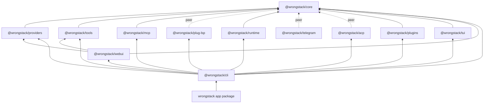

### Import Boundary Guidance

| Layer | Should know about | Should not know about |
|---|---|---|
| `core` | Abstract providers, tools, sessions, permissions, metrics, events. | CLI flags, terminal rendering details, concrete provider packages, browser UI. |
| `providers` | Core `Provider`, `Request`, `Response`, stream and tool formats. | CLI boot, sessions, tool execution, UI. |
| `tools` | Core `Tool`, `Context`, security utilities, serializers. | Provider HTTP APIs, UI, CLI flags. |
| `mcp` | Core `ToolRegistry`, `MCPServerConfig`, `EventBus`, `Logger`. | CLI prompts, TUI/WebUI layout. |
| `cli` | Everything needed to assemble a product runtime. | Provider internals beyond factory construction. |
| `tui` and `webui` | Agent events, slash command surfaces, session/model state. | Provider wire details, tool implementations. |
| `runtime` | Core DI container, runtime composition, host-level wiring. | CLI flags, UI rendering, provider HTTP APIs. |
| `telegram` | Core `Plugin`, `Tool`, `SlashCommandRegistry`, `EventBus`. | CLI boot, provider internals, UI layout. |
| `acp` | Core `Plugin`, agent factory, subagent runner, `ToolTranslator`. | CLI boot internals, UI. |
| `plugins` | Core `Plugin` API, `EventBus`, `ToolRegistry`. | CLI boot internals, provider HTTP APIs, UI. |

## Core Package Anatomy

`@wrongstack/core` is the most important package. It exposes the public runtime surface and most extension points.

```text
packages/core/src/
  kernel/          Container, tokens, pipeline, event bus, run controller.
  core/            Agent, Context, ConversationState, prompt/request building, streaming response, provider runner, input builder, run env, modes, /btw mid-run steering.
  execution/       ToolExecutor, retry, error recovery, compaction, skills, autonomous runner, auto-compaction middleware, intelligent/selective compaction, eternal-autonomy, goal-preamble, parallel-eternal-engine.
  storage/         Sessions, config, memory, queue, plans + plan-templates, todos, recovery, attachments, config migration, goals, session rewind, cloud-sync, annotations, prompt-store, replay-log, session-analyzer, session-recovery, session-event-bridge, tool-audit-log.
  security/        Permission policy, secret vault, secret scrubber, config secrets.
  security-scanner/ Security scanner: orchestrator, detector, scanner, gitignore updater, report generator, skill generator.
  registry/        Tool, provider, and slash command registries.
  plugin/          Plugin API and loader.
  hooks/           Lifecycle hooks: HookRegistry, HookRunner, shell-executor (PreToolUse/PostToolUse/UserPromptSubmit/SessionStart/Stop; shell + in-process). See docs/hooks.md.
  extension/       Agent lifecycle extension registry and extension points (BeforeRun, AfterRun, BeforeIteration, AfterIteration, OnError, wrapProviderRunner, beforeToolExecution, afterToolExecution).
  coordination/    Multi-agent coordinator, Director, FleetBus, FleetManager, delegate tool, bridge, budgets, transport, collab-debug, collab-bus, dispatcher, auto-extend, parallel-eternal-engine, agents (9-phase system), agent-subagent-runner, large-answer-store, subagent-nicknames.
  models/          models.dev registry, model selection (llm-selector), mode-store.
  observability/   Metrics, traces, health, Prometheus, OTLP, event bridge.
  sdd/             Spec-driven development: parser, task generator, task flow, task tracker, graph store, visualizer, spec store, spec builder, spec versioning, spec templates, auto-executor, critical path, task decomposer, parallel run.
  infrastructure/  Logger, token counter, path resolver, context manager, MCP presets.
  types/           Public type contracts.
  defaults/        Backward-compatible re-export barrel for all default implementations.
  utils/           Paths, JSON, glob, diff, color, atomic write, serializers, regex guard, token estimate, json-schema validation, message invariants, newline normalization, todos format.
  autophase/       Auto-phase system: planner, runner, orchestrator, checkpoint, phase-store, phase-graph-builder.
  plugins/         Built-in core plugins: git, observability, plan, prompts, security, skills, sync.
  middleware/      Koa-style middleware: collab-pause.
  worktree/        Git worktree manager for parallel agent workspaces.
  replay/          Session replay via replay-provider-runner and hash-based session lookup.
  tools/           Core-built tools: mcp-control (MCP runtime control via tools).
```

### Core Area Map

The core area changes frequently, so this table tracks responsibilities rather than file counts.

| Area | Notes |
|---|---|
| `types` | Public contracts. Keep these stable and additive when possible. |
| `coordination` | Multi-agent orchestration: director, bridge, fleet, fleet-manager, budgets, transport, collab-debug, collab-bus, dispatcher, auto-extend, parallel-eternal-engine, agents, agent-subagent-runner, large-answer-store, subagent-nicknames. |
| `storage` | JSONL sessions, config, memory, checkpoints, recovery, goal store, queue store, session rewind, cloud-sync, annotations, prompt-store, replay-log, session-analyzer, session-event-bridge, tool-audit-log, plan-templates. |
| `utils` | Shared helpers: paths, JSON, glob, diff, color, atomic write, serializers, regex guard, token estimate, json-schema validation, message invariants, newline normalization, todos format, child-env, merge-models-payload. |
| `execution` | Tool execution, retry, compaction, skill loading, autonomous runner, error handler, auto-compaction middleware, eternal-autonomy, goal-preamble, autonomy-prompt-contributor, parallel-eternal-engine. |
| `sdd` | Parser, generator, flow, tracker, graph store, visualizer, spec store, builder, versioning, templates, auto-executor, critical path, task decomposer, parallel run. |
| `core` | Agent loop, context, conversation state, input builder, run env, streaming response, provider runner, iteration limit, continue-to-next-iteration, system prompt builder, /btw steering, modes. |
| `observability` | Metrics/traces/health integrations, event bridge, OTLP traces/metrics, Prometheus. |
| `security-scanner` | Orchestrator, detector, scanner, gitignore updater, report generator, skill generator, slash-command, types. |
| `autophase` | Auto-phase planner, runner, orchestrator, checkpoint, phase-store, phase-graph-builder, types. |
| `plugins` | Built-in core plugins: git, observability, plan, prompts, security, skills, sync. |
| `kernel` | Low-level primitives: container, pipeline, events, run controller, tokens, index. |
| `infrastructure` | Logger, token counter, path resolver, context manager, MCP presets. |
| `security` | Vault, scrubber, permission policy, config secrets, tool capabilities. |
| `models` | Model registry, LLM selector, mode store. |
| `skills` | Skill loading helpers and built-in skill plumbing. |
| `registry` | Tool, provider, slash-command registries. |
| `extension` | Extension registry, extension points, index. |
| `replay` | Session replay via replay-provider-runner and hash. |
| `worktree` | Git worktree manager for parallel agent workspaces. |
| `tools` | Core-built tools such as mcp-control. |
| `plugin` | Plugin API and loader. |
| `middleware` | Koa-style middleware such as collab-pause. |
| `defaults` | Backward-compatible re-export barrel. |

## Kernel Primitives

The kernel lives in `packages/core/src/kernel`. These primitives should remain small and stable because most higher-level behavior depends on them.

### Container

`Container` is a typed dependency injection container keyed by branded `symbol` tokens from `TOKENS`.

Important properties:

| Feature | Behavior |
|---|---|
| `bind` | Registers a token once; duplicate registration throws a structured `WrongStackError`. |
| `override` | Replaces an existing binding; throws when the token is absent. |
| `decorate` | Wraps a resolved binding with one or more decorators and clears singleton cache. |
| `resolve` | Lazily constructs and memoizes singleton values by default. |
| `unbind` and `clear` | Support plugin/test/runtime cleanup. |
| `inspect` | Exposes owner, singleton/cache status, and decorator count without leaking implementation references. |

The standard tokens are:

```text
Logger, TokenCounter, SessionStore, MemoryStore, PermissionPolicy, Compactor,
PathResolver, ConfigLoader, ConfigStore, Renderer, InputReader, ErrorHandler,
RetryPolicy, SkillLoader, SystemPromptBuilder, SecretScrubber, ModelsRegistry,
ModeStore, ProviderRunner, WorktreeManager, BrainArbiter
```

### Pipeline

`Pipeline<T>` is a Koa-style middleware chain with named middleware and position-aware mutations.

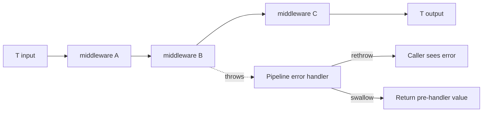

The agent creates six default pipelines:

| Pipeline | Value | Purpose |
|---|---|---|
| `userInput` | `{ content, text, ctx }` | Transform or observe incoming user input before it is appended. |
| `request` | `Request` | Modify provider request body before provider execution. |
| `response` | `Response` | Modify or observe provider response before it is persisted/rendered. |
| `assistantOutput` | `TextBlock` | Transform final assistant text blocks. |
| `toolCall` | `{ toolUse, result, ctx, tool? }` | Observe or transform tool results after execution. |
| `contextWindow` | `Context` | Run compaction/context-window middleware before the next provider turn. |

Plugins receive read-only pipeline views through `DefaultPluginAPI`, so they can inspect and run exposed pipelines but cannot mutate them directly unless the host exposes an explicit mutation API.

### EventBus

`EventBus` is typed pub/sub. Subscribers cannot cancel runtime behavior, and listener exceptions are caught and logged.

Major event families:

| Family | Examples |
|---|---|
| Session | `session.started`, `session.ended`, `session.damaged` |
| Iteration | `iteration.started`, `iteration.completed`, `iteration.limit_reached` |
| Provider | `provider.text_delta`, `provider.thinking_delta`, `provider.response`, `provider.retry`, `provider.error` |
| Tools | `tool.started`, `tool.progress`, `tool.confirm_needed`, `tool.executed` |
| Context | `token.threshold`, `compaction.fired`, `compaction.failed` |
| Subagents | `subagent.spawned`, `subagent.task_started`, `subagent.tool_executed`, `subagent.task_completed` |
| MCP | `mcp.server.connected`, `mcp.server.reconnected`, `mcp.server.disconnected` |
| Error | `error` |

The CLI uses these events for spinner output, streaming text, provider retries, session stats, and diagnostics. The TUI and WebUI use them to drive live UI state.

### RunController

`RunController` owns per-run abort and teardown behavior. `Agent.run` creates one controller per call, chains the parent signal, sets `ctx.signal`, registers context abort hooks, and disposes it in `finally`.

This prevents long-lived tools, streams, MCP clients, and child processes from leaking across agent runs. It also registers iteration-limiting via `ExtensionRegistry.requestLimitExtension` and autonomous-continuation signaling.

## The Live Runtime Objects

### Context

`Context` is the live state object for a run.

It carries:

| Field | Meaning |
|---|---|
| `messages` | Conversation messages sent to providers. |
| `todos` | Session todo list. |
| `readFiles` and `fileMtimes` | Stale-read protection for edit-like tools. |
| `systemPrompt` | System prompt blocks for the active run. |
| `provider`, `model` | Current provider instance and model id. |
| `session` | JSONL session writer. |
| `signal` | Abort signal for the current run. |
| `tokenCounter` | Usage accounting. |
| `cwd`, `projectRoot` | Filesystem scope. |
| `tools` | Tool list visible to prompt construction. |
| `meta` | Extensible metadata bag. |

`ctx.state` exposes an observable `ConversationState` wrapper. New code should mutate through `ctx.state.appendMessage` or related methods when UI/reactive updates matter. Legacy direct writes to `ctx.messages` still work, but direct writes do not emit state-change notifications.

### Agent

`Agent` owns the iterative LLM/tool loop. It depends on registries, pipelines, `Context`, `EventBus`, `Container`, and optional extensions/tracing.

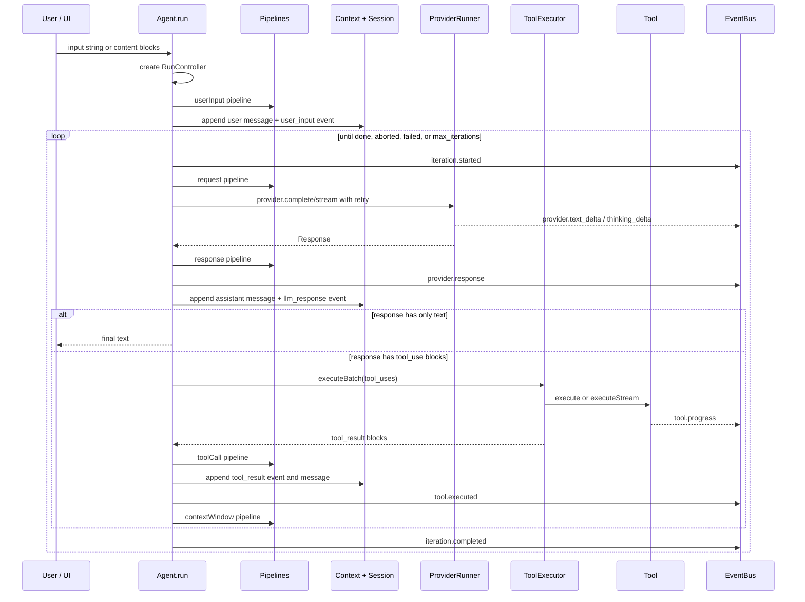

### ToolExecutor

`ToolExecutor` handles tool dispatch and protects the agent loop from tool-level failures.

Key behaviors:

| Behavior | Detail |
|---|---|
| Lookup | Unknown tool names become error `tool_result` blocks instead of hard failures. |
| Permission | Delegates to `PermissionPolicy`; can return auto, confirm, or deny. |
| Confirmation | CLI can provide a `confirmAwaiter`; TUI/WebUI can react to `tool.confirm_needed`. |
| Strategy | `parallel`, `sequential`, or `smart`; smart runs non-mutating tools in parallel, then mutating tools sequentially. |
| Streaming | `executeStream` is preferred when implemented; progress emits `tool.progress`; final output comes from a terminal `final` event. |
| Timeout | Each tool is run with an abortable timeout. |
| Cleanup | `Tool.cleanup` is called best-effort when abort/timeout happens. |
| Scrubbing | Output/errors are serialized, secret-scrubbed, capped, and then persisted. |
| Budget | Per-iteration output is capped to protect provider context and UI/session size. |

## Runtime Boot Flow

The CLI boot path is split into two phases:

1. `packages/cli/src/boot.ts` parses arguments, loads config, handles early subcommands, provider/model picking, and launch prompts. `pre-launch.ts` handles project-kind detection and AGENTS.md initialization prompts.
2. `packages/cli/src/index.ts` wires the runtime: container, providers, tools, events, sessions, prompt builder, MCP, plugins, multi-agent host, slash commands, and agent. Wiring is factored into focused modules under `wiring/`: `session.ts`, `provider.ts`, `pipeline.ts`, `tools.ts`, `plugins.ts`, `slash-commands.ts`, `metrics.ts`, and `replay.ts`.

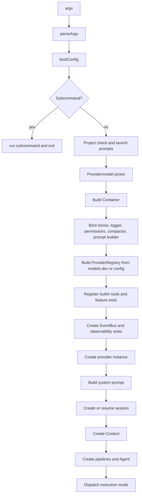

### Execution Modes

`packages/cli/src/execution.ts` chooses the final surface:

| Mode | Trigger | Behavior |
|---|---|---|
| Single-shot | Positional prompt or `--prompt` | Runs `agent.run(query)`, prints result and usage, exits. |
| TUI | `--tui`, configured TUI launch, or goal/ask mode | Lazy-imports `@wrongstack/tui` and passes agent/events/slash commands/state. |
| WebUI | `--webui` [`--port`] [`--open`] | Serves the React frontend (HTTP) + agent WebSocket and runs the REPL in parallel, sharing one agent. Auto-advances past busy ports and registers in `~/.wrongstack/webui-instances.json`. See [`docs/webui.md`](docs/webui.md). |
| REPL | Default non-TUI interactive path | Runs terminal REPL with slash command registry. |

## Configuration and Local State

WrongStack keeps user and project state under `~/.wrongstack` plus optional project-local `.wrongstack` files.

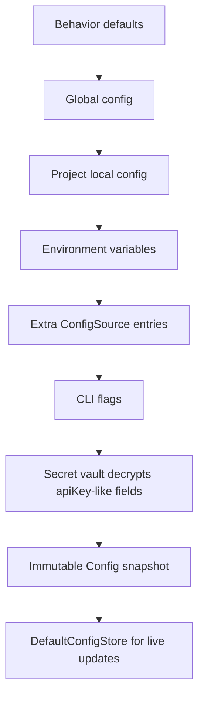

Important files and directories:

| Path | Purpose |
|---|---|
| `~/.wrongstack/config.json` | Global config. |
| `~/.wrongstack/.key` | AES-256-GCM vault key, created lazily. |
| `~/.wrongstack/memory.md` | User-global memory. |
| `~/.wrongstack/skills/` | User-global skills. |
| `~/.wrongstack/projects/<hash>/` | Per-project state. |
| `~/.wrongstack/projects/<hash>/sessions/<id>.jsonl` | Append-only session event log. |
| `~/.wrongstack/projects/<hash>/sessions/<id>.summary.json` | Fast session listing manifest. |
| `~/.wrongstack/projects/<hash>/sessions/<id>.todos.json` | Todo checkpoint. |
| `~/.wrongstack/projects/<hash>/sessions/<id>.plan.json` | Persistent plan checkpoint. |
| `.wrongstack/AGENTS.md` | Optional committable project memory. |
| `.wrongstack/skills/` | Optional committable project skills. |

The root README documents a director-mode fleet workspace shape as well:

```text
sessions/<id>/
  fleet.json
  director-state.json
  shared/
  subagents/<runId>/<subagentId>.jsonl
  attachments/
```

### Session Event Flow

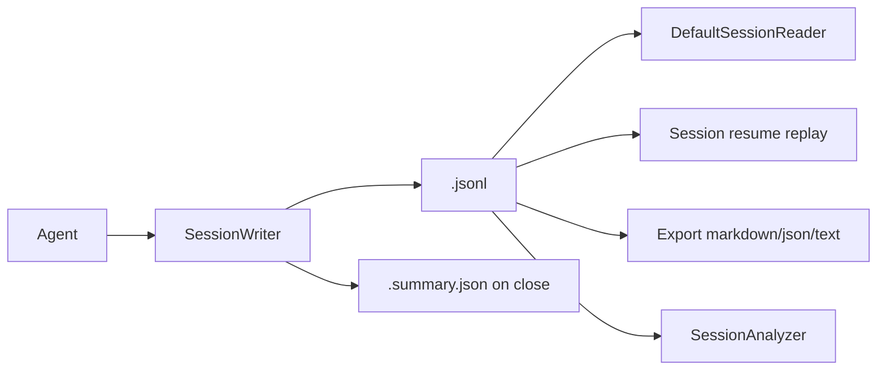

Session replay reconstructs `messages` from `user_input`, `llm_response`, and matching `tool_result` events. Orphan tool results and unmatched tool-use blocks are reported as damaged session events instead of crashing resume/listing flows.

## System Prompt Architecture

`DefaultSystemPromptBuilder` composes the system prompt from layers:

| Layer | Content |
|---|---|
| Identity | WrongStack operating rules and behavioral principles. |
| Tool usage | Registered tools, tool categories, and tool-chain patterns. |
| Environment | cwd, project root, OS, shell, Node, languages, git state, date, provider/model. |
| Memory and skills | Project/user memory plus skill inventory when enabled. |
| Mode | Active mode prompt from `DefaultModeStore`. |
| Plan | Active session plan from `<session>.plan.json`, skipped for subagents. |
| Contributors | System prompt contributors registered through extensions/plugins. |

The builder caches the environment block by project root and marks dynamic memory/mode/plan blocks as ephemeral where supported.

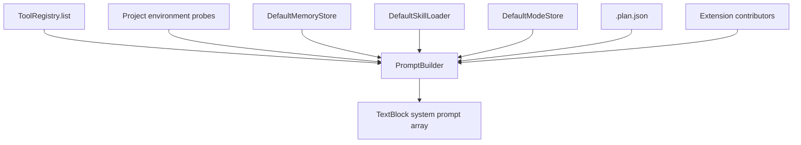

## Providers

`@wrongstack/providers` adapts model APIs into the core `Provider` contract.

### Provider Contract

Core expects providers to expose:

| Method/property | Purpose |
|---|---|
| `id` | Provider id. |
| `capabilities` | Tools, streaming, vision, context, reasoning, etc. |
| `complete(req, opts)` | Return a canonical `Response`. |
| `stream(req, opts)` | Yield canonical streaming events. |

WrongStack normalizes provider responses into canonical content blocks and usage values. The agent loop does not care whether the underlying API is Anthropic Messages, OpenAI Chat Completions, Gemini, or an OpenAI-compatible service.

### Provider Factory Flow

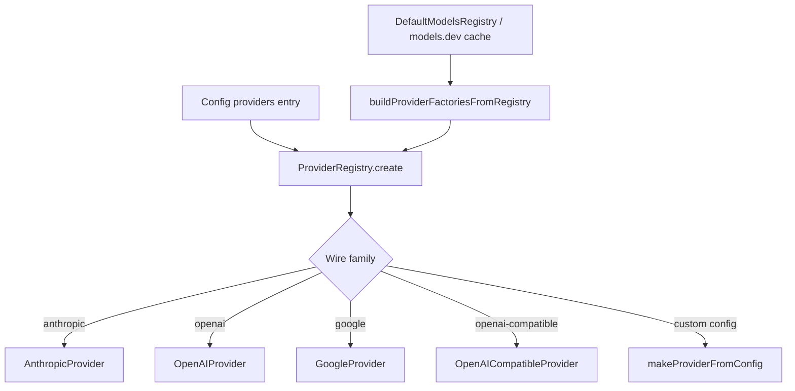

Important provider internals:

| File/area | Responsibility |
|---|---|
| `anthropic.ts`, `openai.ts`, `google.ts` | Native provider classes. |
| `openai-compatible.ts` | Drop-in adapter for `/v1/chat/completions` services. |
| `wire-adapter.ts` | Shared HTTP mechanics: request, SSE parsing, abort, error translation. |
| `wire-format.ts` and `presets/` | Declarative provider definition path. Presets ship for `anthropic`, `google`, `mistral`, and `openai`. |
| `tool-format/` | Conversion between core tools/content blocks and provider-specific wire formats (`to-`/`from-` anthropic and openai). |
| `sse.ts` | SSE parsing with buffer limits. |
| `aggregate.ts` | Stream-event aggregation into a final response. |
| `error-parse.ts` | Provider-specific HTTP error normalization. |
| `capabilities.ts` | Maps catalog capability data into runtime flags. |
| `family-capabilities.ts` | Per-wire-family capability defaults (tools, streaming, vision, reasoning). |
| `stop-reason.ts` | Normalizes provider stop reasons into canonical values. |
| `_tool-input.ts` | Repairs incomplete/streamed tool-input JSON by auto-closing braces and strings. |

## Tool System

Built-in tools live in `@wrongstack/tools`. Each tool implements the core `Tool` interface and declares a JSON schema, permission level, mutating flag, optional risk tier, optional capabilities, and an `execute` or `executeStream` function.

### Built-in Tool Catalog

```text
Filesystem:
  read, write, edit, replace, glob, grep, tree, patch, diff, json

Execution:
  bash, exec, git

Network:
  fetch, search

Project lifecycle:
  lint, format, typecheck, test, install, audit, outdated, logs, document, scaffold

Agent control:
  todo, plan, tool-search, tool-use, batch-tool-use, tool-help, memory, mode

Codebase intelligence:
  codebase-index, codebase-search, codebase-stats

Meta / resilience:
  circuit-breaker, process-registry
```

The default exported `builtinTools` intentionally lives in `packages/tools/src/builtin.ts` so consumers that only need a subset can import individual tools without pulling in the whole catalog. The codebase-intelligence tools (`codebase-index`, `codebase-search`, `codebase-stats`) live in their own `packages/tools/src/codebase-index/` subdirectory alongside the index writer. `packages/tools/src/pack.ts` exports `builtinToolsPack`, a named bundle of the full default tool set. Files prefixed with `_` (`_env`, `_regex`, `_spawn-stream`, `_util`) are shared internal helpers, not standalone tools.

### Tool Call Data Flow

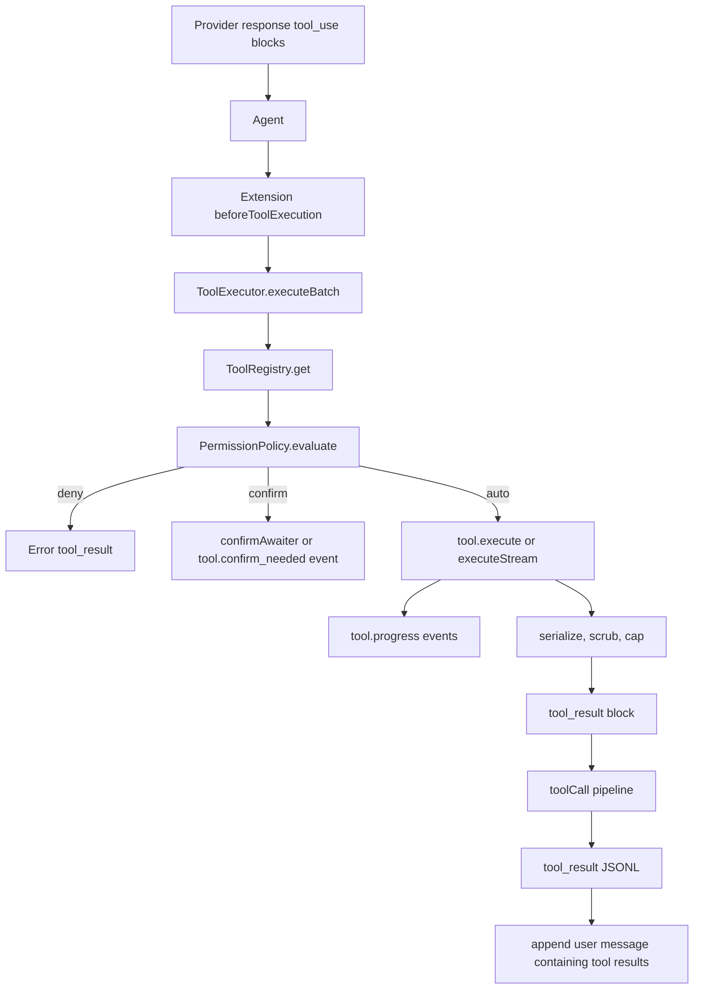

### Permission Model

`DefaultPermissionPolicy` evaluates:

1. Namespace trust rules, including glob-like MCP tool namespaces.
2. Per-tool trust entries.
3. Subject matching based on explicit `subjectKey` or known input fields such as `path`, `url`, `name`, or `command`.
4. Deny rules.
5. Allow/auto rules.
6. YOLO mode: auto for normal project work; destructive-gated calls still confirm unless `--yolo-destructive` is active.
7. Tool default permission.
8. User confirmation via delegate or event.

Subagents use `AutoApprovePermissionPolicy` because they cannot answer interactive prompts. Tool-level `permission: "deny"` is still honored.

## Registries

WrongStack uses registries as the main composition mechanism.

| Registry | Location | Responsibility |
|---|---|---|
| `ToolRegistry` | `packages/core/src/registry/tool-registry.ts` | Register, unregister, wrap, list, and resolve tools. |
| `ProviderRegistry` | `packages/core/src/registry/provider-registry.ts` | Register provider factories and instantiate provider configs. |
| `SlashCommandRegistry` | `packages/core/src/registry/slash-command-registry.ts` | Register REPL/TUI slash commands. |
| `ExtensionRegistry` | `packages/core/src/extension/registry.ts` | Register lifecycle hooks and prompt contributors. |
| `MCPRegistry` | `packages/mcp/src/registry.ts` | Manage MCP clients and register wrapped MCP tools. |

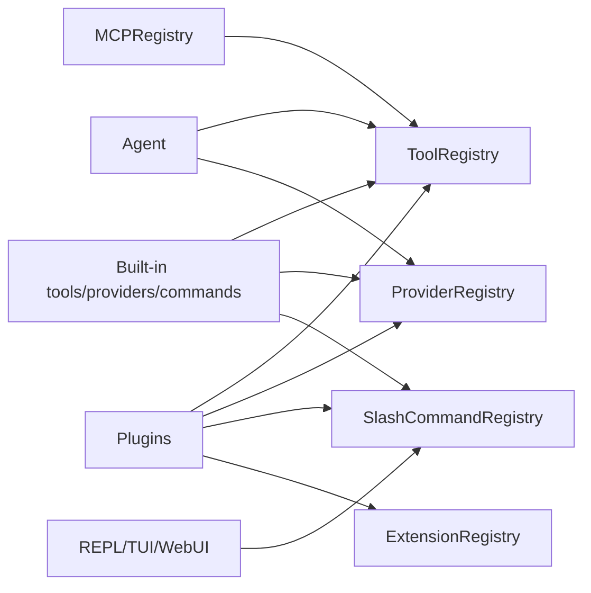

## Plugin and Extension Architecture

WrongStack has two related extensibility layers:

| Layer | Best for | API surface |
|---|---|---|
| Plugin | Packaging installable capabilities: tools, providers, slash commands, MCP, pipeline-aware behavior. | `Plugin.setup(api)` and optional `teardown/health`. |
| Extension | Agent lifecycle hooks and provider/tool/prompt interception. | `AgentExtension` registered into `ExtensionRegistry`. |

### Plugin Loader

`loadPlugins`:

1. Checks `apiVersion` against `KERNEL_API_VERSION` (`0.1.10` in the current source).
2. Validates conflicts.
3. Topologically sorts `dependsOn` and `optionalDeps`.
4. Merges `defaultConfig` with user plugin options.
5. Validates plugin config against `configSchema`.
6. Wraps the API for capability diagnostics/enforcement.
7. Calls `setup(api)`.
8. Records loaded and failed plugins separately.

`unloadPlugins` tears down in reverse load order and logs teardown failures without aborting shutdown.

### Plugin API Shape

Plugins receive:

| API property | Capability |
|---|---|
| `container` | Read/resolve/modify DI bindings. |
| `events` | Subscribe to typed events or emit custom events. |
| `pipelines` | Read-only pipeline views. |
| `tools` | Register, unregister, wrap, list, get tools. |
| `providers` | Register/create/list provider factories. |
| `mcp` | Start/stop/restart/list MCP servers. |
| `slashCommands` | Register/unregister/list slash commands. |
| `session` | Append custom session events. |
| `extensions` | Register agent lifecycle extensions. |
| `registerSystemPromptContributor` | Inject prompt blocks on every prompt build. |
| `config`, `log` | Runtime config and plugin-scoped logger. |

### Extension Hooks

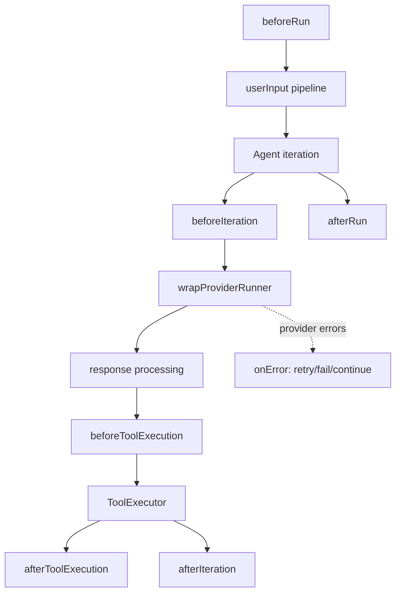

Hook failures are logged independently so one extension does not collapse the whole run.

The `OnErrorHook` can return `{ action: 'retry', model?: string }`, `{ action: 'fail' }`, `{ action: 'continue' }`, or `void` — enabling extensions to drive recovery strategies for provider, tool, or agent-level errors.

## MCP Integration

`@wrongstack/mcp` connects Model Context Protocol servers and wraps their tools into WrongStack tools.

Supported transports:

| Transport | Mechanics |
|---|---|
| `stdio` | Spawn a child process and communicate over stdin/stdout JSON-RPC. |
| `sse` | HTTP Server-Sent Events for server events plus POST requests. |
| `streamable-http` | Session-based HTTP with NDJSON-like streaming. |

### MCP Registry Flow

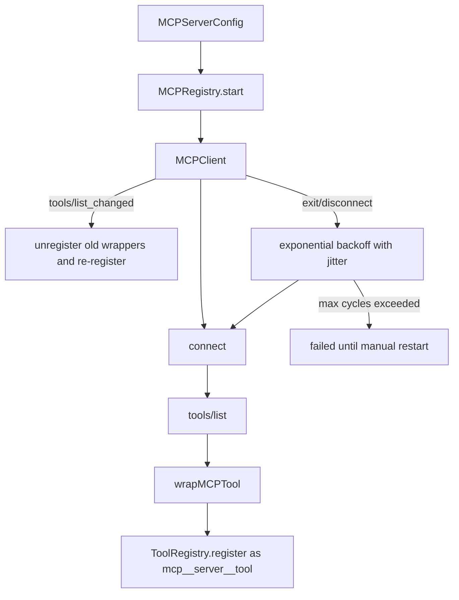

All MCP tools are prefixed as:

```text
mcp__<serverName>__<toolName>
```

This prevents collisions with built-in tools and gives the permission policy a namespace to match.

### Built-in MCP Server Presets

`packages/core/src/infrastructure/mcp-servers.ts` exports factory functions for popular MCP servers. All servers are disabled by default and must be explicitly enabled in config:

| Server | Description | Auth required |
|---|---|---|
| `filesystemServer` | Local filesystem read/write/navigate (read-heavy). | — |
| `githubServer` | GitHub API — issues, PRs, repos, search, file ops. | `GITHUB_PERSONAL_ACCESS_TOKEN` |
| `context7Server` | Codebase-aware documentation and Q&A (context7.ai). | — |
| `braveSearchServer` | Web search (Brave). Free tier 2k queries/month. | `BRAVE_SEARCH_API_KEY` |
| `blockServer` | Postgres database access via SQL (Block MCP server). | — |
| `everArtServer` | AI image generation (EverArt). | `EVERART_API_KEY` |
| `slackServer` | Slack — messaging, channels, search. | `SLACK_BOT_TOKEN` + team/user token |
| `awsServer` | AWS — EC2, S3, Lambda, IAM, CloudFormation, costs. | AWS credentials |
| `googleMapsServer` | Google Maps — directions, geocoding, places. | `GOOGLE_MAPS_API_KEY` |
| `sentinelServer` | Security vulnerability scanning (Sentinel). | — |
| `zaiVisionServer` | Z.AI Vision MCP — image analysis and screenshot understanding. | `Z_AI_API_KEY` |
| `miniMaxVisionServer` | MiniMax MCP — image understanding via `understand_image`. | `MINIMAX_API_KEY` + `uvx` |

To enable any server, set `mcpServers: { serverName: { enabled: true } }` in config. Use `allServers()` to get the full set for `wstack mcp add --all`.

## Multi-Agent and Director Architecture

WrongStack has three levels of multi-agent support:

1. A lazy `MultiAgentHost` in the CLI for `/spawn` and related slash commands.
2. A richer `Director` layer in `core/coordination` for manifest-backed, tool-driven orchestration.
3. A `CollabSession` mode for parallel BugHunter + RefactorPlanner + Critic analysis on the same target code.

Important coordination files:

```text
packages/core/src/coordination/
  multi-agent-coordinator.ts     CLI multi-agent host and lazy coordinator.
  agent-subagent-runner.ts       Agent factory and subagent runner construction.
  subagent-budget.ts            Budget negotiation and threshold signals.
  agent-bridge.ts               In-memory bridge transport between leader and subagents.
  agents.ts                     Fleet roster constants: AUDIT_LOG_AGENT, BUG_HUNTER_AGENT, etc.
  agents/                       9-phase agent definitions (phase1-discovery through phase9-meta).
  in-memory-transport.ts        In-process transport for bridged subagents.
  transport.ts                  Abstract transport interface.
  director.ts                   Rich director layer for manifest-backed orchestration.
  director-session.ts           Per-subagent JSONL transcript factory.
  director-prompts.ts           Director and subagent prompt composition.
  director-tools.ts             LLM-callable director tools (spawn, assign, await, roll_up, etc.).
  fleet-bus.ts                  Fan-in event bus aggregating subagent events.
  fleet.ts                      Fleet roster: FLEET_ROSTER, ACP_AGENTS, budget constants.
  fleet-manager.ts              Fleet lifecycle and health management.
  ifleet-manager.ts             Fleet manager interface.
  icoordinator.ts               Coordinator interface.
  null-fleet-bus.ts             No-op fleet bus for single-agent sessions.
  delegate-tool.ts              Delegate tool for cross-agent task handoff.
  collab-debug.ts               CollabSession for parallel BugHunter + RefactorPlanner + Critic.
  collab-bus.ts                 In-memory event bus for collab-debug sessions.
  collab-debug-tool.ts          makeCollabDebugTool for launching collab sessions.
  dispatcher.ts                 LLM-based agent dispatch: scoreAgents, dispatchAgent.
  auto-extend.ts                AutoExtendPolicy for automatic session continuation.
  parallel-eternal-engine.ts   Eternal-engine for autonomous parallel goal pursuit.
  large-answer-store.ts         Sidecar store keeping large ask_subagent results out of the director's context window.
  subagent-nicknames.ts         Domain-affinity nickname pool (scientists/mathematicians) for spawned subagents.
```

### Coordinator Flow

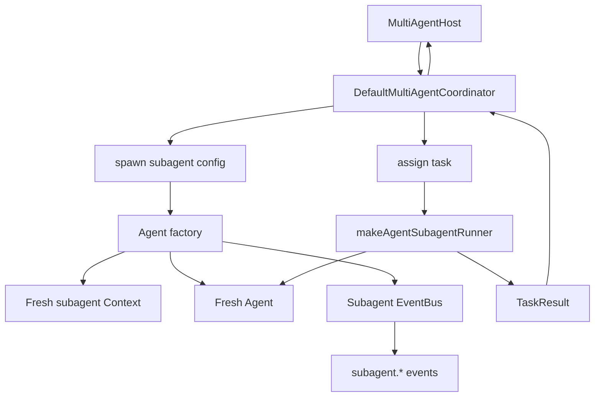

### Director Mode

`Director` wraps the coordinator and exposes LLM-callable orchestration tools such as:

```text
spawn_subagent, assign_task, await_tasks, ask_subagent, roll_up,
terminate_subagent, fleet_status, fleet_usage, fleet_health, fleet_emit, work_complete
```

There is also a parallel `CollabSession` mode (`makeCollabDebugTool`) that runs BugHunter, RefactorPlanner, and Critic agents in parallel and aggregates their findings.

Director-mode advantages:

| Capability | Description |
|---|---|
| Per-subagent sessions | `makeDirectorSessionFactory` creates per-subagent JSONL transcripts. |
| Fleet manifest | `fleet.json` records director run metadata, children, providers, models, tasks, usage. |
| FleetBus | Fan-in stream of subagent provider/tool/iteration events. |
| Usage aggregation | `FleetUsageAggregator` rolls up per-subagent tool and provider usage. |
| Shared scratchpad | Optional shared directory for cross-subagent findings. |
| State checkpoint | `director-state.json` captures live task/subagent state for resume/retry UX. |

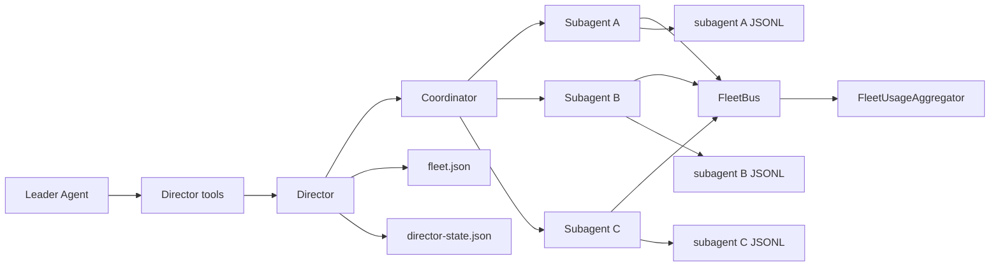

The CLI can promote a session into director mode if a non-director coordinator is not already active. Once plain `/spawn` has created a coordinator, promotion is blocked because live state cannot be safely migrated.

### Auto-Phase System

The `autophase/` area (`packages/core/src/autophase/`) provides an autonomous phase-based workflow system for large projects. It splits work into named phases with dependency awareness, priority, time estimates, and parallelizability.

Key components:

| Component | Responsibility |
|---|---|
| `AutoPhasePlanner` | Generates a phased plan from a task description using the LLM. |
| `AutoPhaseRunner` | Executes phases autonomously, running independent phases in parallel, respecting dependencies. |
| `PhaseOrchestrator` | Coordinates phase transitions, checkpoints, and event emission. |
| `PhaseGraphBuilder` | Builds a dependency graph from phase definitions. |
| `PhaseStore` | Persists phase state for resume after interruption. |
| `CheckpointManager` | Saves/restores phase progress snapshots. |

**Verification gate.** After a phase's tasks all succeed, the orchestrator runs an optional verify gate (`PhaseExecutionContext.verifyPhase`) inside the phase's worktree *before* marking it completed and merging back. On failure it invokes `repairPhase` (a repair subagent given the verifier output) and re-verifies, up to `maxVerifyAttempts` (default 2); if it still fails the phase is marked `failed` and its worktree is kept for review rather than merged. The CLI host (`autophase-host.ts`) wires this to the project's `typecheck`/`lint` scripts (auto-detected, or `WRONGSTACK_AUTOPHASE_VERIFY_CMD`); disable with `WRONGSTACK_AUTOPHASE_VERIFY=0`. When no `verifyPhase` is wired the gate is skipped (back-compatible).

Auto-phase runs emit WebSocket events via the `autophase-ws-handler` in WebUI, allowing real-time progress visualization in the browser.

### Git Worktree Manager

The `worktree/` area (`packages/core/src/worktree/`) provides `WorktreeManager` — a Git worktree orchestration layer used by the AutoPhase system to create isolated parallel workspaces for concurrent agent phases. It is now a first-class kernel DI token (`TOKENS.WorktreeManager`), so hosts can resolve, decorate, or override the manager through the container like any other core service.

Each `WorktreeHandle` transitions through states: `allocating → active → committing → merging → merged`, with failure handling at any stage. Worktree lifecycle events are broadcast via `worktree-ws-handler` to WebUI for live status display.

**Conflict resolution.** `WorktreeManager.merge()` accepts an optional `resolve` callback (`MergeOpts.resolve`). On a squash-merge conflict it hands the conflicted paths and base working tree to the resolver *before* aborting; if the resolver clears every marker (validated with `git diff --cached --check`) the merge is committed and `MergeResult.resolved` is `true`. Any failure or surviving marker falls through to the original safe path — `git reset --hard` + `needs-review`, work preserved on the branch. AutoPhase wires this through `PhaseExecutionContext.resolveConflict` to a resolver subagent (CLI host); a conflict therefore no longer silently strands a phase's work. Disable with `WRONGSTACK_AUTOPHASE_RESOLVE=0`.

## UI Architecture

WrongStack has three major user surfaces:

| Surface | Package/file | Runtime model |
|---|---|---|
| REPL | `packages/cli/src/repl.ts` | Terminal prompt loop driven by slash commands and `Agent.run`. |
| TUI | `packages/tui` | Ink/React UI subscribing to events and operating on shared agent/session state. |
| WebUI | `packages/webui` plus `packages/cli/src/webui-server.ts` | Browser React app communicating with a WebSocket backend. |

### CLI/TUI Event Flow

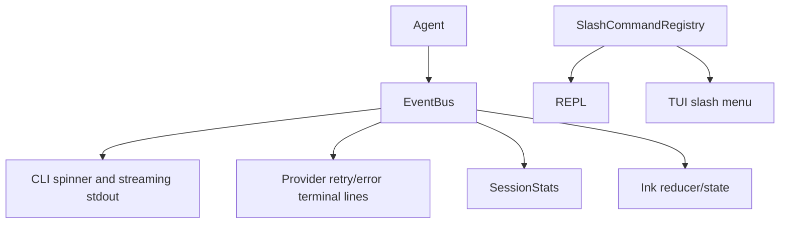

### WebUI Flow

The WebUI package (`packages/webui`) includes both the frontend (React + Vite) and a backend service. The CLI also has a `webui-server.ts` launcher path, which reuses the webui package's static-serve / free-port / browser-opener / instance-registry building blocks via the `@wrongstack/webui/server` export (so that logic lives in one place). Both launch paths serve the frontend over HTTP (`PORT`, default 3456), run the agent WebSocket (`WS_PORT`, default 3457), auto-advance past busy ports unless `WEBUI_STRICT_PORT=1`, inject the live WS port into the served HTML as `<meta name="wrongstack-ws-port">` (so multiple instances work), and record themselves in `~/.wrongstack/webui-instances.json` (`wstackui --list`). Full reference: [`docs/webui.md`](docs/webui.md).

The backend WebSocket server (`packages/webui/src/server/`) handles multiple handler types:

| Handler | Purpose |
|---|---|
| `collaboration-ws-handler.ts` | Real-time collaboration events, shared cursors, fleet state. |
| `autophase-ws-handler.ts` | Auto-phase progress updates and phase transitions. |
| `worktree-ws-handler.ts` | Git worktree creation, status, and lifecycle events. |

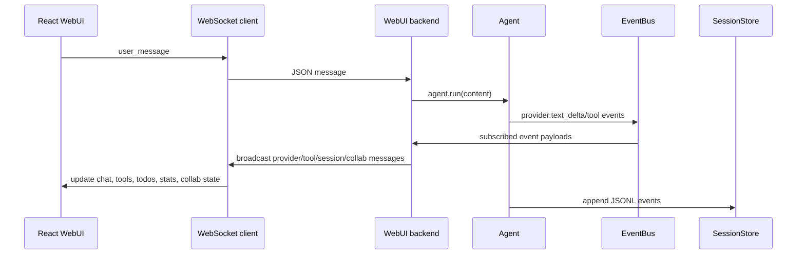

WebUI backend notes:

| Concern | Implementation |
|---|---|
| Credential parity | Boots config and secret vault similarly to CLI. |
| Socket binding | Defaults to loopback, with IPv4/IPv6 loopback handling. |
| CSWSH guard | Restricts browser origins to loopback hosts unless no Origin is present. |
| Concurrent runs | Uses a run lock to avoid corrupting shared context with simultaneous `user_message` calls. |
| Model/key management | WebSocket messages can list/add/remove providers and keys. |
| Live updates | Broadcasts provider deltas, tool starts/progress/results, todos, stats, diagnostics. |

## LSP Plugin

`@wrongstack/plug-lsp` exposes language-server capabilities as WrongStack tools and slash commands.

```text
packages/plug-lsp/src/
  server/          LSP connection, initialization, lifecycle, capabilities.
  tools/           definition, references, rename, hover, diagnostics, symbols, code actions, workspace-edit, codebase-lsp-search.
  slash-commands/  start, stop, restart, diagnostics, list.
  formatters/      Human-readable formatting for diagnostics, hover, symbols, locations.
  utils/           URI, timeout, safe spawn, command resolver.
```

The package declares `@wrongstack/core` as a peer dependency, keeping it plugin-like and avoiding a hard runtime copy of core.

## Runtime Package

`@wrongstack/runtime` is a transitional package that provides hosts with a stable import target for default implementations. It re-exports concrete implementations from `@wrongstack/core` subpaths and adds host-level composition helpers.

```text
packages/runtime/src/
  index.ts       Re-exports from core/defaults, core/infrastructure, plus local modules.
  pack.ts        WrongStackPack: bundled runtime configuration pack.
  host.ts        RuntimeHost and RuntimeHostParts interfaces for host composition.
  container.ts   Container setup helpers.
  vision.ts      Vision/image processing utilities.
  clipboard.ts   Clipboard integration.
```

The long-term boundary is:

| Package | Responsibility |
|---|---|
| `@wrongstack/core` | Kernel, agent runtime, registries, public contracts. |
| `@wrongstack/runtime` | Default storage, security, config, observability, compaction, models, skills, host composition. |

Currently the implementations still physically live in `core` and are re-exported through `runtime`. This gives hosts a stable import path while later moves happen behind the facade.

## Telegram Plugin

`@wrongstack/telegram` is an official WrongStack plugin that bridges the agent to Telegram.

```text
packages/telegram/src/
  index.ts              Plugin definition, setup, and teardown.
  bot.ts                TelegramBot client: send, receive, HTML formatting.
  config.ts             Plugin config schema and Telegram-specific settings.
  slash-commands/       /telegram slash command registration.
  tools/
    telegram-send.ts    Tool: send messages to Telegram chats.
    telegram-read.ts    Tool: read recent Telegram messages.
```

The plugin declares `@wrongstack/core` as a peer dependency and registers:

| Surface | Registered items |
|---|---|
| Tools | `telegram-send`, `telegram-read` |
| Slash commands | `/telegram` for status and configuration |
| Events | Subscribes to agent events for notification forwarding |

Official plugin alias: `wstack plugin install telegram`.

## ACP Package

`@wrongstack/acp` provides WrongStack's ACP (Agent Communication Protocol) integration in two directions:

**DIR-2 — WrongStack as ACP Server:** `WrongStackACPServer` runs inside a host process and exposes WrongStack tools over stdio JSON-RPC to external ACP clients.

**DIR-1 — WrongStack as ACP Client:** `makeACPSubagentRunner` spawns external ACP agent processes and wraps their tools so the WrongStack leader agent can assign tasks to them.

```text
packages/acp/src/
  agent/           StdioTransport, WrongStackACPServer, ACPToolsRegistry, ACPProtocolHandler.
  client/          ToolTranslator for mapping external tool schemas to core tool format.
  integration/     ACP subagent runner (makeACPSubagentRunner, makeACPSubagentRunnerWithStop).
  types/           ACP message types (acp-messages).
```

The package declares `@wrongstack/core` as a peer dependency and is used by the CLI's multi-agent host to support ACP-capable subagents.

## Plugins Package

`@wrongstack/plugins` is a bundled library of 10 installable plugins published as a single package. Each subdirectory is a self-contained plugin:

| Plugin | Capability |
|---|---|
| `auto-doc` | Auto-generate JSDoc/TSDoc comments for functions and types. |
| `cost-tracker` | Track and report per-session and per-file LLM usage costs. |
| `cron` | Schedule recurring agent tasks via cron expressions. |
| `file-watcher` | Trigger agent runs when watched files change on disk. |
| `git-autocommit` | Automatically commit changes when a session ends. |
| `json-path` | Query and transform JSON with JSONPath expressions via a tool. |
| `semver-bump` | Detect and propose semantic version bumps based on conventional commits. |
| `shell-check` | Run shell script analysis via `shellcheck` after `bash`/`exec` tools. |
| `template-engine` | Render template files with agent-provided variables. |
| `web-search` | Web search tool backed by a configurable search provider. |

Plugins in this package follow the standard `Plugin.setup(api)` pattern. They can be enabled via config or the `/plugin` slash command.

## Storage and Persistence

WrongStack uses append-only JSONL for primary session truth and small JSON sidecars for fast lookups or resumable UI state.

```mermaid
flowchart TD
  Config[DefaultConfigLoader] --> ConfigStore[DefaultConfigStore]
  Vault[DefaultSecretVault] --> Config
  Agent --> SessionStore[DefaultSessionStore]
  Agent --> Todos[todos checkpoint]
  SlashPlan[/plan or plan tool] --> Plan[plan checkpoint]
  MultiAgent[Director] --> DirectorState[director-state.json]
  MultiAgent --> FleetManifest[fleet.json]
  Attachments[AttachmentStore] --> SessionDir[session attachments]
  Recovery[RecoveryLock] --> ActiveLock[active.json]
```

### Persistence Contracts

| Component | Contract |
|---|---|
| `DefaultConfigLoader` | Deep-merges default/global/project/env/extra/CLI config, blocks prototype pollution keys, decrypts secrets. |
| `ConfigMigration` | Versioned `{ from, to, migrate }` triples for evolving config schema. Migrations run sequentially at load time. |
| `DefaultConfigStore` | Holds live runtime config and supports watchers for runtime switches. |
| `DefaultSessionStore` | Creates/resumes/loads/lists/deletes JSONL sessions and writes summaries. |
| `DefaultSessionReader` | Query/replay/search/export over stored sessions. |
| `RecoveryLock` | Detects abandoned sessions that died without `session_end`. |
| `DefaultMemoryStore` | Reads/writes layered memory across user/project scopes. |
| `QueueStore` | Persists queued tasks. |
| `AttachmentStore` | Spools file/image attachments under session directories. |
| `DirectorStateCheckpoint` | Mirrors live multi-agent task graph for crash recovery/retry. |
| `PhaseStore` | Persists auto-phase state for resume after interruption. |
| `CheckpointManager` | Saves/restores phase progress snapshots. |
| `SessionRecovery` | Read-side companion to in-flight recovery state; reconstructs interrupted sessions. |
| `ToolAuditLog` | Tamper-evident audit trail recording every `tool_use`/`tool_result` pair. |
| `AnnotationsStore` | Sidecar storage for collaboration annotations. |
| `PromptStore` | Persists reusable prompt entries. |
| `ReplayLogStore` | Sidecar store backing deterministic session replay. |
| `SessionAnalyzer` | Computes derived analytics/summaries over stored sessions. |
| `PlanTemplates` | In-memory pre-defined plan skeletons for common workflows. |

## Security Architecture

WrongStack runs on the user's machine with filesystem and shell access, so its security model focuses on explicit trust boundaries, secret handling, constrained tool behavior, and auditability.

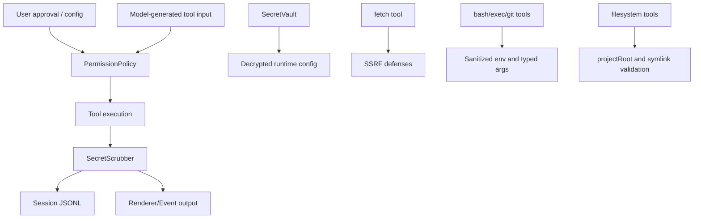

Important controls visible in the repository:

| Control | Location/behavior |
|---|---|
| Secret vault | `DefaultSecretVault` uses AES-256-GCM and a 32-byte local key file. |
| Config secret decryption | `decryptConfigSecrets` / `encryptConfigSecrets` walk config objects and decrypt/encrypt apiKey-like fields in place. Per-field decrypt errors are swallowed to avoid killing entire config load. |
| Plaintext migration | Config boot migrates plaintext secret-bearing fields to encrypted form. |
| Config version migration | `config-migration.ts` provides a `{ from, to, migrate }` migration framework for evolving config schema across versions. |
| Secret scrubbing | Tool outputs and errors are scrubbed before rendering/persisting. |
| Permission prompts | `DefaultPermissionPolicy` supports deny/allow/auto/yolo/user confirmation; YOLO auto-approves normal project work while `--yolo-destructive` controls destructive-gated calls. |
| Trust file | Per-project trust policies are persisted and matched by tool/subject. |
| Child env sanitization | Execution tools sanitize environment by default. |
| SSRF hardening | `fetch` validates private CIDRs and redirects. |
| Regex guard | `grep`, `replace`, and `logs` use ReDoS-oriented regex constraints. |
| Output caps | Tool outputs are capped per iteration before going back into model context. |
| Session replay validation | Malformed JSONL entries are skipped; damaged tool pairings are reported. |
| WebSocket origin check | WebUI rejects non-loopback browser origins by default. |

See `SECURITY.md` for the full threat model.

## Observability

Observability is opt-in and interface-driven.

| Pillar | Components |
|---|---|
| Metrics | `InMemoryMetricsSink`, `NoopMetricsSink`, `wireMetricsToEvents`, Prometheus renderer/server, OTLP metrics exporter. |
| Tracing | `NoopTracer`, `OTelTracer`, provider/tool/agent spans. |
| Health | `DefaultHealthRegistry` and `/healthz` when metrics server is enabled. |

```mermaid
flowchart LR
  EventBus --> MetricsBridge[wireMetricsToEvents]
  MetricsBridge --> Sink[MetricsSink]
  Sink --> Snapshot[metrics.json]
  Sink --> Prometheus[/metrics]
  Sink --> OTLP[OTLP metrics exporter]
  Agent --> Tracer[Tracer]
  ToolExecutor --> Tracer
  ProviderRunner --> Tracer
  Health[HealthRegistry] --> Healthz[/healthz]
```

The CLI writes a metrics snapshot to the project session directory on shutdown when metrics are enabled.

## Built-in Skills and Modes

Bundled skills live in `packages/core/skills` (16 total):

```text
api-design        audit-log         bug-hunter        docker-deploy
git-flow          multi-agent       node-modern       observability
prompt-engineering react-modern    refactor-planner  sdd
security-scanner  skill-creator     testing           typescript-strict
```

`DefaultSkillLoader` can load bundled, user-global, and project-local skills. `DefaultSystemPromptBuilder` includes skill entries in the environment block when the skills feature is enabled.

Modes are handled by `DefaultModeStore` (modes: `default`, `brief`, `teach`); the active mode contributes a prompt layer and can be switched by CLI/TUI/WebUI surfaces.

## Spec-Driven Development Area

The `sdd` area provides:

| Component | Purpose |
|---|---|
| `SpecParser` | Parse structured specs. |
| `SpecBuilder` | Build specs programmatically. |
| `SpecVersioning` | Version-aware spec migration. |
| `SpecTemplates` | Reusable spec templates. |
| `TaskGenerator` | Turn specs into generated tasks. |
| `TaskTracker` | Track task transitions. |
| `TaskFlow` / `SpecDrivenDev` | Coordinate spec-driven workflows. |
| `TaskGraphStore` | Persist task dependency graph. |
| `TaskVisualizer` | Render task graphs visually. |
| `AutoExecutor` | Auto-execute spec-driven task flows. |
| `CriticalPath` | Compute and track critical path through tasks. |
| `SddTaskDecomposer` | Convert a `TaskGraph` into a dependency-aware decomposition for parallel execution. |
| `SddParallelRun` | Drive a `TaskGraph` through `ParallelEternalEngine` infrastructure for concurrent task execution. |

This area is independent of the normal agent loop but can be surfaced through tools, slash commands, or specialized modes/skills.

## End-to-End Data Flow

The following diagram shows the main data paths from user input to persisted state.

```mermaid
flowchart TD
  User[User input] --> UI{Surface}
  UI -->|single-shot| CLI
  UI -->|REPL| CLI
  UI -->|TUI| TUI
  UI -->|WebSocket| WebUI
  CLI --> Agent
  TUI --> Agent
  WebUI --> Agent

  Agent --> Context[Context messages/state]
  Agent --> Prompt[System prompt + messages + tools]
  Prompt --> Provider[Provider]
  Provider -->|text/tool_use/usage| Agent
  Agent -->|tool_use| ToolExecutor
  ToolExecutor --> Tools[Built-in/MCP/plugin tools]
  Tools --> ToolExecutor
  ToolExecutor --> Agent

  Agent --> Session[Session JSONL]
  Agent --> Events[EventBus]
  Events --> CLI
  Events --> TUI
  Events --> WebUI
  Events --> CollabWS[collaboration-ws-handler]
  Events --> AutophaseWS[autophase-ws-handler]
  Events --> Metrics[Metrics/health/traces]
  Session --> Resume[Resume/export/analyze]
  AutoPhase[AutoPhaseRunner] -.-> Events
  AutoPhase --> Worktree[WorktreeManager]
  Worktree --> WorktreeWS[worktree-ws-handler]
  WorktreeWS -.-> WebUI
```

## Extension Points by Use Case

| Goal | Preferred extension point |
|---|---|
| Add a new provider from an existing wire family | Register a `ProviderFactory` or add a `WireFormatConfig` preset in `@wrongstack/providers`. |
| Add a project tool | Implement `Tool` and register through plugin API or host wiring. |
| Wrap an existing tool | `api.tools.wrap(name, wrapper)`. |
| Modify provider requests | Request pipeline or `wrapProviderRunner` extension. |
| Add prompt context | `registerSystemPromptContributor`. |
| React to agent lifecycle | `AgentExtension` hooks. |
| Add a slash command | `api.slashCommands.register` or CLI slash-command module. |
| Manage plugins at runtime | `/plugin` slash command or `wstack plugin` subcommand. Official aliases: `telegram`, `lsp`. |
| Add external tool servers | MCP config or `api.mcp.start`. |
| Replace storage/permissions/logging | DI container token override/decorator. |
| Add metrics/traces | Bind tracer/sink or subscribe to `EventBus`. |
| Add multi-agent role | Extend `FLEET_ROSTER` or spawn custom subagent configs. |
| Spawn external ACP agents | Use `makeACPSubagentRunner` from `@wrongstack/acp` via the multi-agent host. |
| Use bundled plugins | Enable via config or `/plugin`; use `@wrongstack/plugins` for the full library. |

## Testing and Verification Structure

The repository has broad unit and integration coverage across packages.

```mermaid
flowchart LR
  Vitest[vitest] --> CoreTests[core tests]
  Vitest --> ToolTests[tools tests]
  Vitest --> ProviderTests[providers tests]
  Vitest --> McpTests[mcp tests]
  Vitest --> CliTests[cli tests]
  Vitest --> TuiTests[tui tests]
  Vitest --> LspTests[plug-lsp tests]
  Vitest --> RuntimeTests[runtime tests]
  Vitest --> TelegramTests[telegram tests]
  Vitest --> ACPTests[acp tests]
  Vitest --> PluginsTests[plugins tests]
  Bench[vitest bench] --> Perf[core perf benches]
```

Common commands:

```bash
pnpm test
pnpm typecheck
pnpm lint
pnpm build
pnpm bench
pnpm test:coverage
```

Risk-oriented testing guidance:

| Change type | Suggested verification |
|---|---|
| Core agent loop | Core agent/execution tests, provider runner tests, tool executor tests. |
| Tool behavior | Specific tool tests plus security edge cases if filesystem/shell/network is touched. |
| Provider adapter | Provider wire-format, streaming, stop reason, error parsing, tool formatting tests. |
| Config/storage | Storage/config/session/recovery tests. |
| CLI slash command | CLI tests and targeted REPL/slash command tests. |
| TUI rendering | TUI component/reducer tests. |
| WebUI behavior | Typecheck plus dedicated server/WS tests; package now has 8 test files covering lib utilities and server boot/auth. |
| Multi-agent/director | Coordination and CLI multi-agent/director tests. |
| MCP behavior | MCP registry/client/transport/wrap-tool tests. |
| LSP plugin | Unit plus integration/e2e tests under `packages/plug-lsp/tests`. |
| Runtime package | Typecheck plus runtime composition/pack/host tests. |
| Telegram plugin | Plugin setup/teardown, bot integration, tool and slash command tests. |
| ACP integration | ACP transport, protocol handler, subagent runner tests. |
| Bundled plugins | Per-plugin tests for smoke, config schema, and teardown. |

## Common Change Recipes

### Add a Built-In Tool

1. Create `packages/tools/src/<tool>.ts`.
2. Implement the core `Tool` interface with schema, permission, mutating flag, and `execute` or `executeStream`.
3. Add focused tests under `packages/tools/tests`.
4. Export it from `packages/tools/src/index.ts`.
5. Add it to `packages/tools/src/builtin.ts` only if it should be included by default.
6. Consider security review: path validation, env handling, output caps, subject key, and cleanup.

### Add a Provider

1. If it matches an existing family, add catalog/config support and use `OpenAICompatibleProvider` or a `WireFormatConfig`.
2. If it needs a custom wire shape, implement or extend `WireAdapter`.
3. Add stream parsing tests, non-stream response tests, error parse tests, tool input tests, and stop reason tests.
4. Register through `buildProviderFactoriesFromRegistry` or through a plugin.

### Add a Slash Command

1. Add or update a module in `packages/cli/src/slash-commands`.
2. Wire it from `buildBuiltinSlashCommands`.
3. Keep user-facing output concise and terminal-friendly.
4. Add CLI tests for parsing and handler behavior.

### Add a Plugin Capability

1. Extend `types/plugin.ts` if the surface is public.
2. Update `DefaultPluginAPI` if the runtime API changes.
3. Update `KERNEL_API_VERSION` only for breaking plugin surface changes.
4. Add loader/API tests for capability warnings, config schema, dependency sorting, and teardown.
5. Update `docs/plugin-author-guide.md`.

### Modify Agent Loop Semantics

1. Read `packages/core/src/core/agent.ts`, `context.ts`, and `execution/tool-executor.ts`.
2. Check whether the change belongs in a pipeline, extension hook, provider runner wrapper, or the loop itself.
3. Preserve event order unless there is a deliberate migration plan.
4. Preserve JSONL session replay compatibility.
5. Add tests around final status, iteration count, abort, provider errors, tool errors, and session events.

## Architectural Invariants

These invariants are worth protecting in reviews:

| Invariant | Why it matters |
|---|---|
| `core` stays independent of product surfaces. | Keeps the runtime embeddable and plugin-friendly. |
| Provider-specific formats stop at provider adapters. | The agent loop should only see canonical requests/responses/content blocks. |
| Tool failures become tool results when possible. | A single bad tool call should not collapse an entire model turn. |
| User and project state are append-only or atomically written. | Resume, crash recovery, and trust/config updates must survive interruption. |
| EventBus is observe-only. | Subscribers should not create hidden control flow. |
| Pipeline and extension failures are isolated where designed. | Plugins should be diagnosable without making the host fragile. |
| Subagents do not share mutable run state. | Context/session/tool state isolation keeps fleet behavior understandable. |
| Secrets are decrypted late and scrubbed before output. | Prevents accidental persistence or rendering of credentials. |
| Permission decisions are explicit. | Model-generated tool input is untrusted until policy/user approval allows it. |
| Output is capped before returning to the model. | Prevents one tool from flooding context and session logs. |

## Current Architecture Notes

The repository also contains historical and design-focused architecture docs:

| Document | Role |
|---|---|
| `docs/architecture.md` | Detailed lower-level architecture narrative. Some package naming there reflects compatibility barrels and earlier `defaults/` terminology. |
| `docs/director-architecture.md` | Design and shipped-phase notes for director orchestration. |
| `docs/tool-author-guide.md` | Tool contract details. |
| `docs/provider-author-guide.md` | Provider contract details. |
| `docs/plugin-author-guide.md` | Plugin authoring details. |
| `docs/plugin-management.md` | Plugin management CLI commands and config workflow. |

When implementation and design docs disagree, prefer the current source tree and tests, then update the relevant doc.

## Quick Orientation Checklist

If you are new to the codebase, read in this order:

1. `packages/core/src/core/agent.ts`
2. `packages/core/src/core/context.ts`
3. `packages/core/src/kernel/{container,pipeline,events,tokens}.ts`
4. `packages/core/src/execution/tool-executor.ts`
5. `packages/core/src/extension/extension-points.ts`
6. `packages/core/src/extension/registry.ts`
7. `packages/cli/src/boot.ts`
8. `packages/cli/src/pre-launch.ts`
9. `packages/cli/src/index.ts`
10. `packages/cli/src/execution.ts`
11. `packages/cli/src/wiring/{session,provider,pipeline}.ts`
12. `packages/tools/src/builtin.ts`
13. `packages/providers/src/index.ts`
14. `packages/core/src/plugin/{api,loader}.ts`
15. `packages/cli/src/multi-agent.ts`
16. `packages/cli/src/plugin-management.ts`
17. `packages/core/src/coordination/director.ts`
18. `packages/core/src/autophase/auto-phase-runner.ts` (autonomous phase workflow)
19. `packages/core/src/worktree/worktree-manager.ts` (parallel workspace isolation)

That path gives you the runtime loop first, then the extension system, then the boot assembly (including project detection and wiring), then the plugin management and multi-agent layers.
