# Autonomous Coordinator — Architecture and Operating Guide

The Autonomous Coordinator is WrongStack's project-level coordination layer: it turns a broad goal into shared goals, exposes those goals to the fleet, assigns runnable work to Director-managed subagents, tracks outcomes, and records decisions/facts for other sessions in the same project.

This document describes the intended working system, the critical wiring required for it to work, and the current implementation after the 2026-06-21 repair pass.

---

## 1. Executive Summary

The coordinator is not just another autonomy loop. `/autonomy eternal` drives the current leader session; `AutonomousCoordinator` coordinates a project-level multi-agent system.

It must have three things to do real work:

1. a **live Director** instance, not a stale `null` snapshot;
2. the Director's **FleetBus/FleetManager**, so task lifecycle, usage, and UI events have a single source;
3. a stable **goal id = task id** mapping, so DAG readiness, auction claims, Director assignments, and completion events all update the same record.

Before the repair pass, the system could create goals and emit UI events, but it could fail to actually dispatch selected work because `execution.ts` captured `director` before lazy promotion and `AutonomousCoordinator` was constructed without `director`. It also created a second auction task during `_processGoal()`, splitting the original goal id from the assigned task id.

After the repair pass, `/coordinator start <goal>` can create or reuse the coordinator through a live Director getter, pass Director/FleetManager into core, and assign the original goal id to a subagent.

### Feasibility status

**Current status: partially operational, not yet the full cross-session autonomous marketplace described by the high-level design.**

Implemented and verified:

- `/coordinator start|stop|status` command wiring.
- Live Director lookup after lazy runtime promotion.
- Goal decomposition into `GoalNode`s.
- Goal mirroring into `TaskDAG`.
- Brain-based prioritization of pending goals.
- Direct Director spawn/assign for the selected goal.
- Stable `goalId === taskId` assignment invariant.
- `subagent.completed` with `status='success'` marks the task done instead of failed.
- Completion/failure is mirrored back into the DAG.
- Coordinator startup rebuilds baseline DAG nodes from persisted `KnowledgeGraph` goals.
- Completed auction task results are persisted onto the `GoalNode` for restart rebuilds.
- Completed task results are also published as `quality` facts tagged `task-result` for later coordinator decisions.
- `NEXT:`, `TODO:`, and `FOLLOW-UP:` lines in task results create follow-up goals tagged `follow-up`.
- Terminal-driven task discovery and claiming via `/coordinator tasks` and `/coordinator claim`.
- Cross-session DAG sync: run loop periodically reloads KnowledgeGraph and syncs DAG with goals from other terminals (throttled 5s); manual sync via `syncFromGraph()`.
- TUI event subscription path for coordinator timeline events.

Still incomplete / aspirational:

- Cross-session real-time push: sync is file-polling based (throttled 5s), not real-time event-driven push between terminals.
- True idle-agent marketplace behavior: `TaskAuctioneer.bid/findWork/claim` exists, but terminal-driven task discovery/claim is now wired through `/coordinator tasks` and `/coordinator claim`; automatic polling of claimable work by terminals and richer bidder heuristics are still pending.
- Robust `runUntilComplete`: the loop now backs off while DAG nodes are running, but it still needs stronger await/aggregation semantics for long-running tasks and result-driven follow-up planning.
- Autonomous result interpretation: task completion summaries become `task-result` facts and explicit `NEXT:`/`TODO:`/`FOLLOW-UP:` markers become follow-up goals, but richer parsing into specific findings, code-change proposals, or consensus requests is not implemented yet.
- Full autonomous code-change governance: `ConsensusProtocol` and `ChangeManager` exist, but end-to-end proposal → quality gate → consensus → apply is not yet driven by coordinator workers.
- Documentation examples that imply fully shared project state should be read as target architecture unless explicitly listed above as implemented.

---

## 2. Component Map

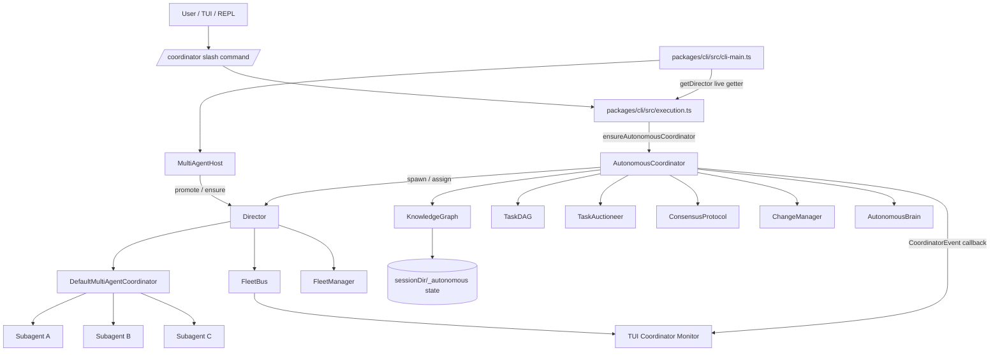

### Core files

| Layer | File | Responsibility |
|---|---|---|
| CLI entry | `packages/cli/src/cli-main.ts` | Owns mutable `director`; passes `getDirector: () => director` into execution. |
| Execution wiring | `packages/cli/src/execution.ts` | Lazily creates `AutonomousCoordinator`, adapts LLM provider, exposes start/stop/event subscriptions to TUI/slash context. |
| Slash command | `packages/cli/src/slash-commands/coordinator.ts` | User-facing `/coordinator start|stop|status`. |
| Core coordinator | `packages/core/src/coordination/autonomous-coordinator.ts` | Decomposes goals, runs decision loop, coordinates DAG/auction/Director/consensus. |
| Brain | `packages/core/src/coordination/autonomous-brain.ts` | LLM-backed prioritization/approval decisions. |
| Knowledge | `packages/core/src/coordination/knowledge-graph.ts` | Persistent facts, goals, decisions, and change records. |
| Auction | `packages/core/src/coordination/task-auctioneer.ts` | Shared task marketplace and assignment state. |
| DAG | `packages/core/src/coordination/task-dag.ts` | Dependency-aware readiness/completion tracking. |
| UI hook | `packages/tui/src/hooks/use-autonomous-coordinator.ts` | Subscribes to coordinator events and dispatches reducer actions. |
| UI reducer | `packages/tui/src/app-reducer.ts` | Builds coordinator monitor timeline and counters. |

---

## 3. Runtime Wiring

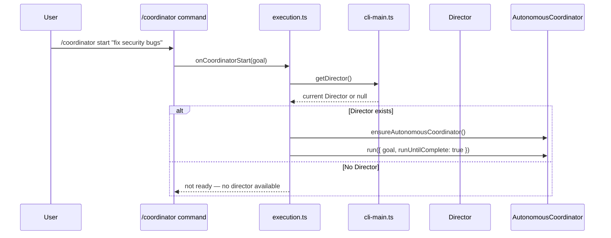

The important design detail is that `execute()` must not rely only on the `director` value passed at startup. Director mode can be enabled later via `/director`, `/delegate`, or other fleet paths. Therefore `ExecutionDeps` carries both:

```ts
director: Director | null;              // startup snapshot
getDirector?: () => Director | null;    // live getter
```

`ensureAutonomousCoordinator()` uses the getter first:

```ts
const currentDirector = getDirector?.() ?? director;
if (!currentDirector) return null;
```

This is what makes runtime promotion visible to `/coordinator start`.

---

## 4. Goal Lifecycle

```mermaid
flowchart LR
  A[/coordinator start goal/] --> B[Decompose goal]
  B --> C[Publish GoalNode via TaskAuctioneer]
  C --> D[Mirror same id into TaskDAG]
  D --> E[Brain chooses next optionId]
  E --> F[TaskDAG getReady]
  F --> G[Emit task:ready]
  G --> H[Director spawn worker]
  H --> I[Auction claim original goalId]
  I --> J[Director assign task id = goalId]
  J --> K[Subagent works]
  K --> L[FleetBus subagent.completed]
  L --> M[Auction complete/fail original goalId]
  M --> N[Emit task:completed or goal:failed]
```

### Stable id invariant

The same id must flow through these layers:

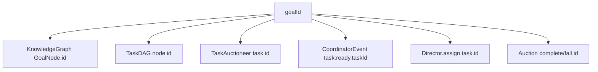

If `_processGoal()` publishes a second auction task, the graph splits:

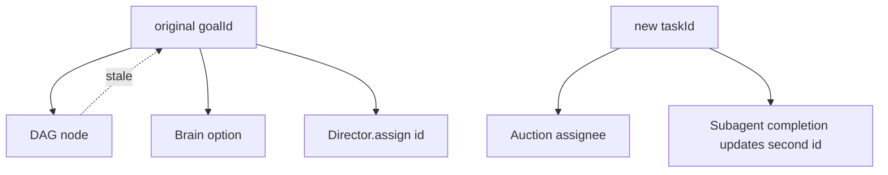

That split was removed. `_processGoal()` now emits `task:ready` using `taskId: goalId`, claims `goalId`, and assigns `goalId` to Director.

---

## 5. Autonomous Loop

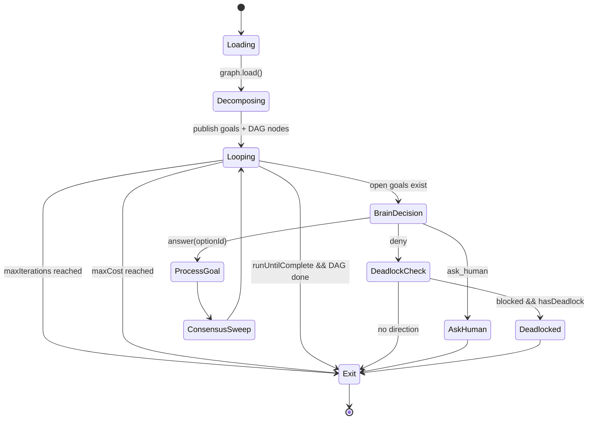

### Main loop responsibilities

1. Load persisted graph state.
2. Decompose the input goal into one or more goal/task records.
3. Publish each goal into the auction and mirror it into the DAG.
4. Ask `AutonomousBrain` which pending goal to prioritize.
5. Start the selected ready DAG node.
6. If Director is available, spawn/assign a subagent.
7. Process pending changes through consensus and quality gates.
8. Exit on explicit stop, completion, max iteration, cost cap, ask-human, or deadlock.

---

## 6. Event Flow

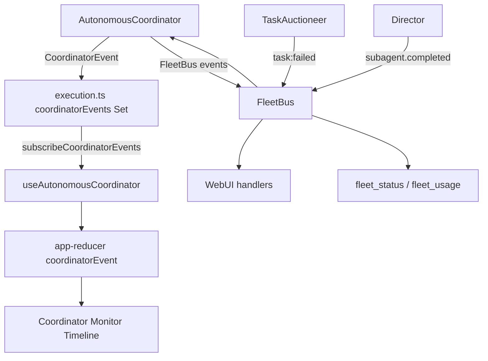

### Coordinator events consumed by TUI

| Event | Meaning | UI kind |
|---|---|---|
| `coordinator:mode` | Coordinator started in `standalone` or `fleet` mode. | mode/status |
| `goal:added` | Goal/task was published. | goal |
| `task:ready` | Dependencies are satisfied; task can run. | task |
| `task:completed` | Subagent completed assigned task. | task |
| `goal:failed` | Task failed or subagent ended abnormally. | goal |
| `knowledge:added` | Fact was published to graph/mailbox. | knowledge |
| `consensus:reached` | Pending change was approved/rejected. | consensus |
| `deadlock:detected` | DAG blocked cycle or no progress state. | deadlock |

---

## 7. Data Model

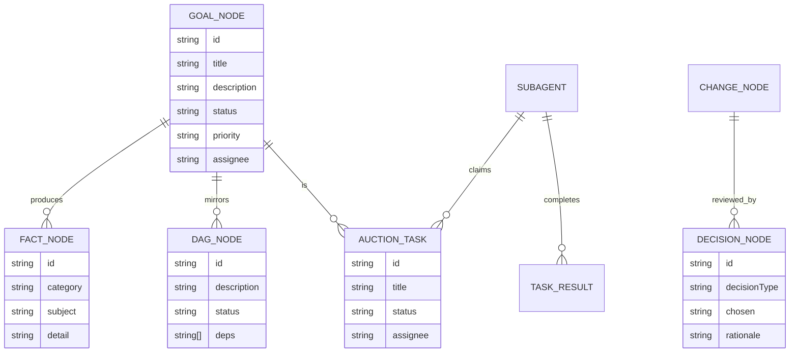

### Persistence expectation

The coordinator's graph is backed by files under the session/project coordination state directory. Multiple terminals in the same project can discover the same facts/goals through the shared graph/mailbox layer.

---

## 8. Start/Stop Semantics

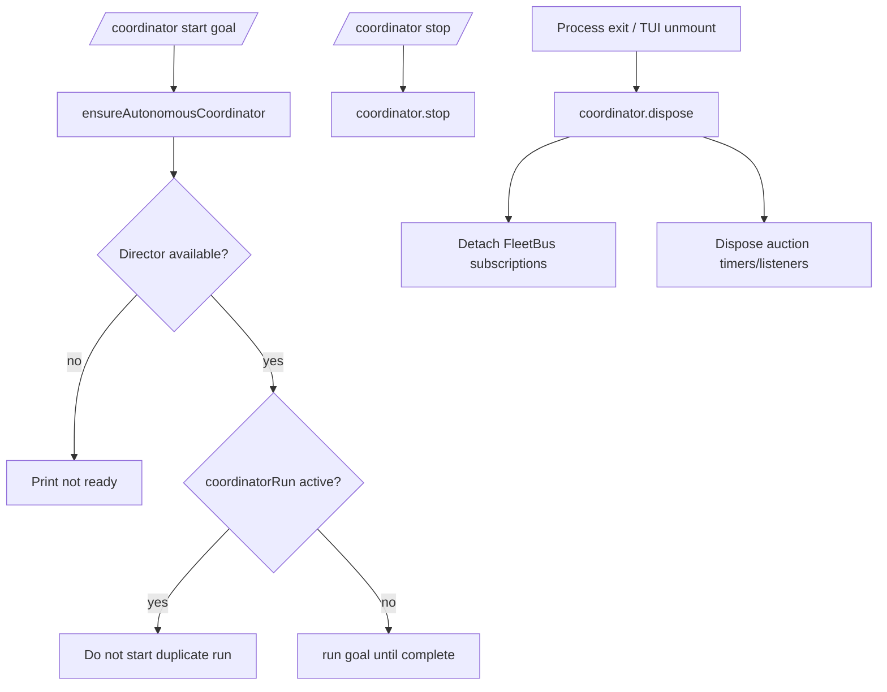

`/coordinator stop` stops the active loop. Process cleanup uses `dispose()` to also remove event subscriptions and auction timers. This distinction matters for long-lived TUI sessions where start/stop can happen more than once.

---

## 9. Repair Pass — 2026-06-21

### Problems found

| Problem | Impact | Fix |
|---|---|---|
| `execute()` received `director` as a startup snapshot. | Lazy Director promotion after startup was invisible to `/coordinator start`. | Added `getDirector?: () => Director | null`; `ensureAutonomousCoordinator()` reads live Director. |
| `AutonomousCoordinator` was constructed without `director` and `fleetManager`. | It could publish goals but not spawn/assign work itself. | Pass `director`, `fleet`, and `fleetManager` from live Director. |
| `_processGoal()` published a second auction task. | Goal id, DAG id, auction task id, and Director assignment could diverge. | Removed duplicate publish; claim/assign original `goalId`. |
| Brain prompt serialized context as an object interpolation. | LLM saw `[object Object]`, reducing decision quality. | Use `JSON.stringify(prompt.context)`. |
| Cleanup only called `stop()`. | Event subscriptions/timers could survive in long-lived process lifecycle. | Process cleanup calls `dispose()`. |

### Repaired flow

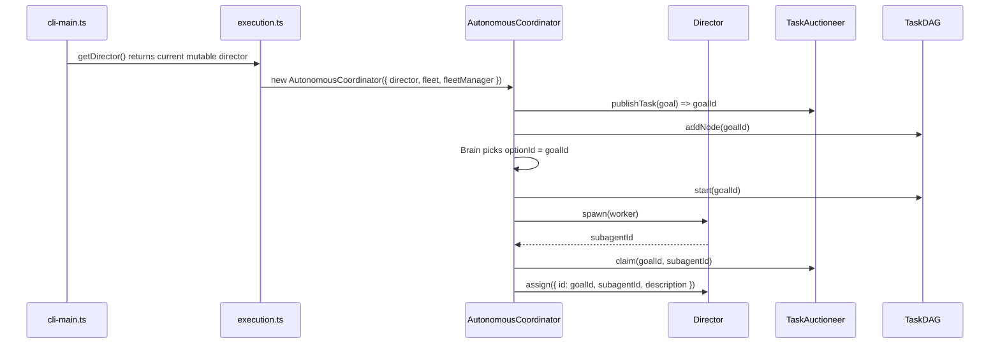

---

### Idle-agent marketplace vs terminal workers

The coordinator does not require a long-lived idle subagent pool. Any open
terminal/session on the same project is an eligible worker. Pending tasks are
discoverable via `/coordinator tasks` and can be claimed via
`/coordinator claim <id>`. Claiming marks the goal as `in_progress` assigned
to that terminal; the terminal then performs the work and reports completion
through the same coordinator graph.

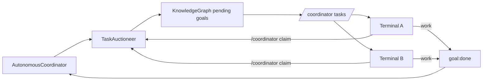

When a Director is present the coordinator can still spawn/assign subagents
directly. Terminal-driven claims and Director-driven assignments both funnel
through the same auction `claim()` path and update the shared graph.

### Terminal-driven task lifecycle

```text
/coordinator start "audit security"
/coordinator tasks
/coordinator claim <id>          # injects task description as next prompt
# agent works on the task...
/coordinator done <id> [note]    # marks task complete, publishes result fact
# or
/coordinator fail <id> <reason>  # marks task failed
```

Claim marks the goal as `in_progress` assigned to the terminal session. Done/fail report the outcome through the same `_completeTask`/`_failTask` path as subagent completions, so the auction, DAG, task-result facts, and follow-up goal extraction all work identically.

### Start coordinator

```text
/coordinator start audit and fix security issues in auth
```

### Stop coordinator

```text
/coordinator stop
```

### Inspect status

```text
/coordinator status
```

### Recommended operational sequence

```mermaid
flowchart LR
  A[Start WrongStack] --> B[Enable Director mode]
  B --> C[/coordinator start goal]
  C --> D[Open F11 Coordinator Monitor]
  D --> E[Watch goals/tasks/knowledge]
  E --> F[/fleet status or fleet_usage]
  F --> G[/coordinator stop when done]
```

If the coordinator reports `not ready — no director available`, promote to Director mode first through the existing fleet/director surfaces.

---

## 11. Testing and Verification

### Targeted checks

```text
packages/core/tsconfig.json typecheck
packages/cli/tsconfig.json typecheck
packages/core/tests/coordination/autonomous-coordinator.test.ts
```

### Added regression coverage

A test now verifies that when the brain selects a ready goal and a Director is present:

1. `task:ready.taskId` equals `goalId`;
2. `Director.assign()` receives `task.id === goalId`;
3. `TaskAuctioneer.getTasksForAgent(subagentId)` returns the same original goal id.

### Known test environment issue seen during repair

The test tool invoked the root Vitest suite instead of only the requested file. All test files that started passed, but Vitest exited with an unhandled environment error:

```text
Cannot find package 'jsdom' imported from global vitest
Failed to start forks worker for packages/cli/tests/hq-dashboard.test.ts
```

That is an environment/dependency resolution issue in the global Vitest process, not a failing Autonomous Coordinator assertion.

---

## 12. Troubleshooting

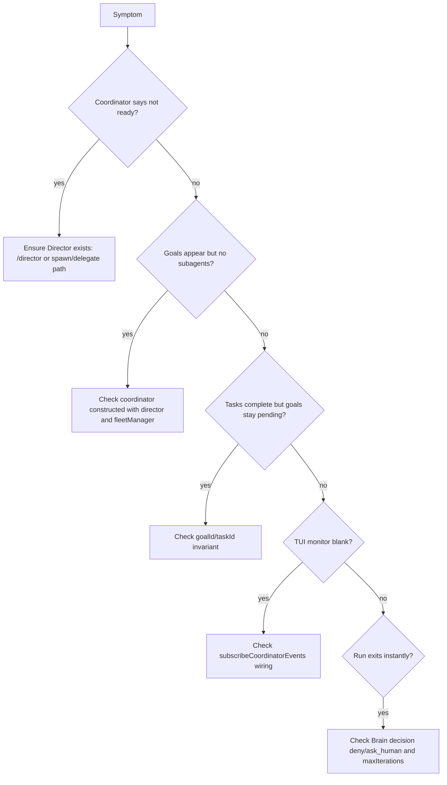

### Common failure modes

| Symptom | Likely cause | File to inspect |
|---|---|---|
| `/coordinator start` prints not ready | No live Director has been created/promoted. | `packages/cli/src/execution.ts`, `packages/cli/src/cli-main.ts` |
| Goals show, no task assignment | Coordinator constructed without `director`. | `packages/cli/src/execution.ts` |
| Subagent completes but goal remains pending | Duplicate task id / goal id split. | `packages/core/src/coordination/autonomous-coordinator.ts` |
| TUI monitor receives no events | Missing `subscribeCoordinatorEvents` prop/hook. | `packages/tui/src/app.tsx`, `packages/tui/src/hooks/use-autonomous-coordinator.ts` |
| Consensus handling throws unknown voter | Coordinator self id missing from voters. | `_buildVoters()` in `autonomous-coordinator.ts` |
| Process leaks handlers after stop | `stop()` used where `dispose()` is needed. | `packages/cli/src/execution.ts` |

---

## 13. Relationship to Other Autonomy Systems

```mermaid
flowchart TB
  Goal[/goal] --> Eternal[/autonomy eternal]
  Goal --> Parallel[/autonomy parallel]
  Goal --> Coordinator[/coordinator start]

  Eternal --> LeaderLoop[Leader session self-driving loop]
  Parallel --> Fanout[Parallel tick fan-out]
  Coordinator --> ProjectCoordination[Project-level shared coordination]

  ProjectCoordination --> Knowledge[KnowledgeGraph]
  ProjectCoordination --> Auction[TaskAuctioneer]
  ProjectCoordination --> Consensus[ConsensusProtocol]
  ProjectCoordination --> Director[Director-managed fleet]
```

| System | Scope | Driver | Main purpose |
|---|---|---|---|
| `/autonomy auto` | Current session | Suggested next prompts | Continue turn-by-turn automatically. |
| `/autonomy eternal` | Current session | `EternalAutonomyEngine` | Serial long-running goal execution. |
| `/autonomy parallel` | Current session + fleet | `ParallelEternalEngine` | Per-tick fan-out/aggregate loop. |
| `/coordinator` | Project / multi-session | `AutonomousCoordinator` | Shared goals, tasks, facts, consensus, and Director assignments. |

---

## 14. Implementation Checklist for Future Changes

Before considering Autonomous Coordinator changes complete, verify:

- [ ] `/coordinator` command is registered in `buildBuiltinSlashCommands()`.
- [ ] `ExecutionDeps` has a live Director getter, not just a startup snapshot.
- [ ] `AutonomousCoordinator` receives `director`, `fleet`, and `fleetManager` when Director exists.
- [ ] `task:ready.taskId === goalId` for Director-assigned work.
- [ ] `Director.assign({ id })` uses the original `goalId`.
- [ ] `TaskAuctioneer.claim()` claims the original `goalId`.
- [ ] TUI receives events through `subscribeCoordinatorEvents`.
- [ ] Process cleanup uses `dispose()` at session exit.
- [ ] Core and CLI typecheck pass.
- [ ] Regression test covers Director assignment and id invariants.

---

## 15. Sequence Diagram — Full Happy Path

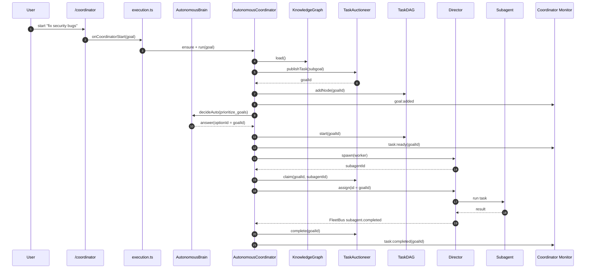
