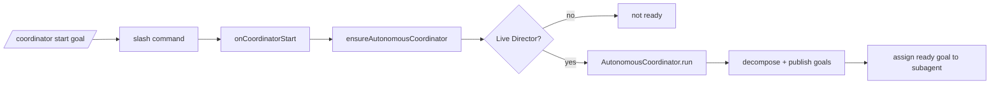
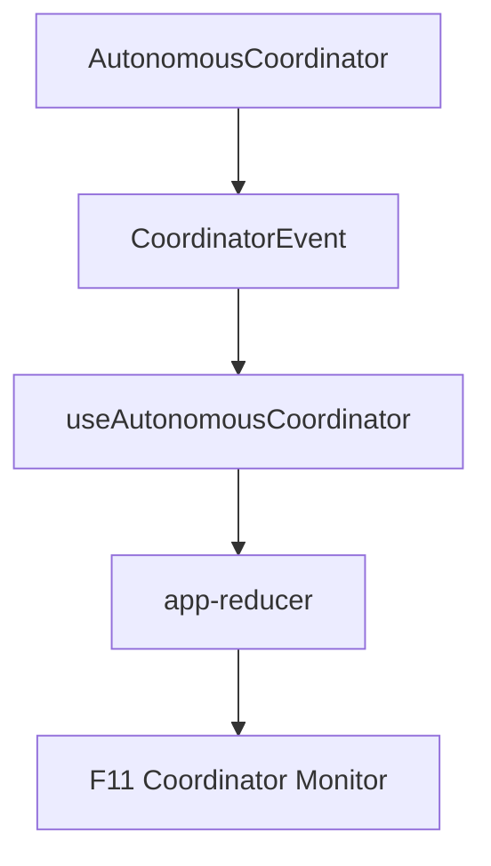

# /coordinator — Autonomous Coordinator

`/coordinator` starts, stops, and inspects the project-level Autonomous Coordinator. It is separate from `/autonomy`: autonomy drives the current session, while the coordinator manages shared goals, task auctioning, knowledge, consensus, and Director-assigned subagents across the project.

## Usage

```text
/coordinator start <goal>   Start the coordinator with a goal
/coordinator stop           Stop the running coordinator loop
/coordinator status         Show whether start/stop hooks are wired
```

## Flow



## Requirements

The command can only do real work when a live `Director` exists. The CLI passes a live `getDirector()` getter into `execution.ts` so a Director promoted after startup is visible to `/coordinator start`.

If you see:

```text
[coordinator] not ready — no director available
```

promote/create a Director first through `/director`, `/delegate`, or another fleet path that initializes Director mode.

## Monitor

Use the TUI Coordinator Monitor (F11) to watch coordinator events:



Events include `goal:added`, `task:ready`, `task:completed`, `knowledge:added`, `consensus:reached`, and `deadlock:detected`.

## Detailed documentation

See [`docs/autonomous-coordinator.md`](../autonomous-coordinator.md) for architecture diagrams, lifecycle details, troubleshooting, and implementation invariants.
